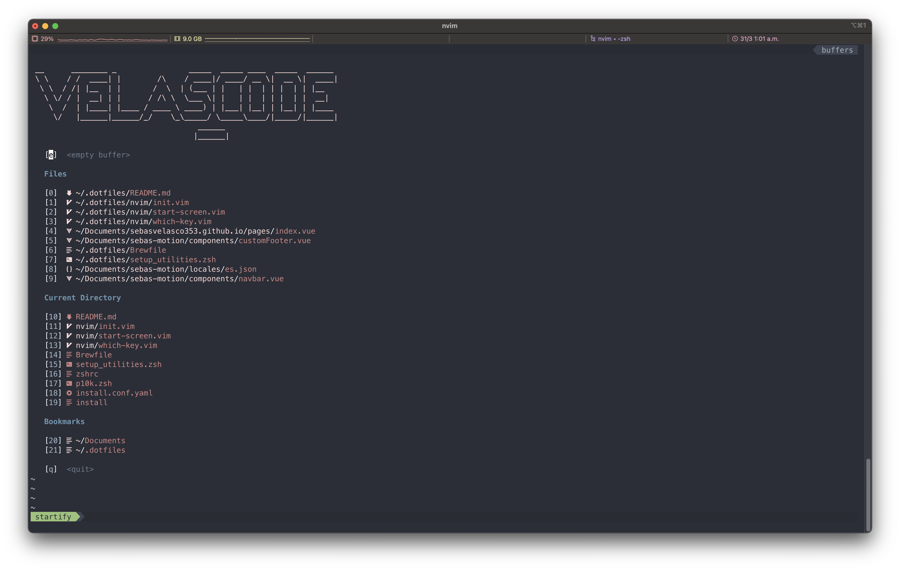
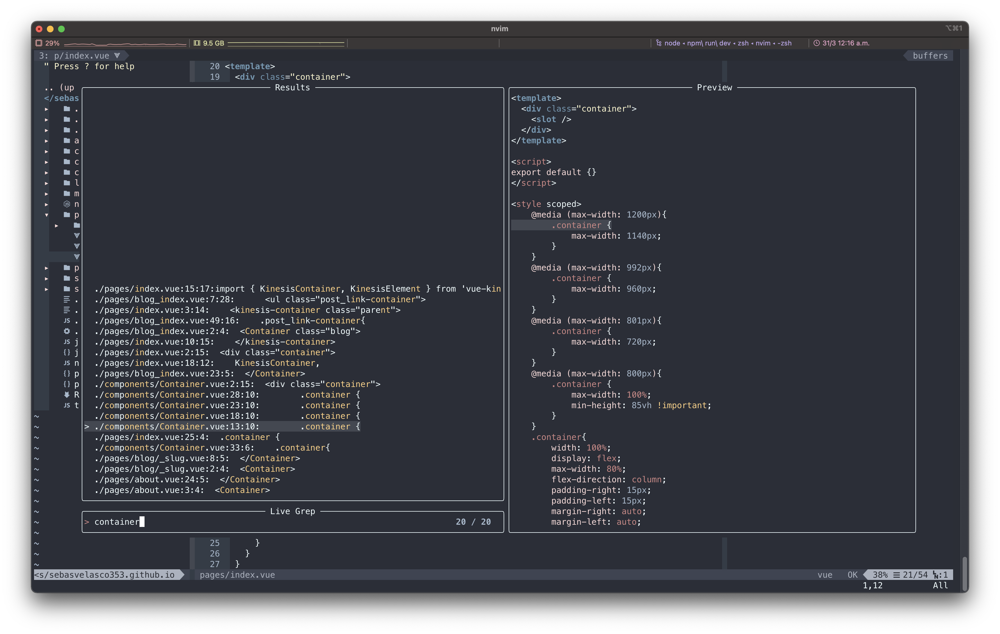
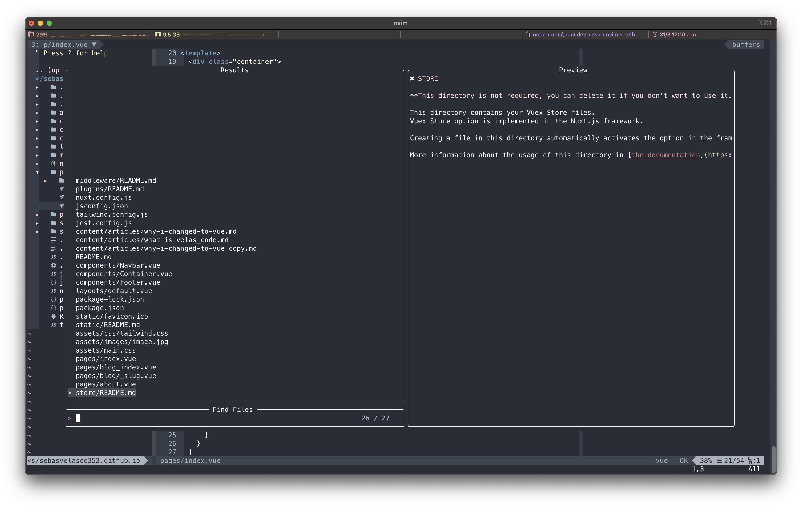

# .dotfiles
collection of my dot files with some scripts to install things as easy as possible.

this repo was created based on the course and recommendations of [Patrick McDonald](https://twitter.com/EIEIOxyz) in the udemy course [Dotfiles from Start to Finish-ish](https://www.udemy.com/course/dotfiles-from-start-to-finish-ish/?referralCode=445BE0B541C48FE85276)

## REMEMBER
after installing new casks (apps) with brew, if you want them to be automatically installed with the
install script remember to add them to the brew file using this command in the .dotfiles folder:
```
brew bundle dump --force --describe
```

## TODO:
- Finish the manual installation text
- Add global npm package.json file (where is it!?!?!)
- Add platformio plugin to VS Code or find a way to code, run, autocomplete and linter arduino in nvim

## Install using script
1. cd into the repo folder and run install script
```
cd .dotfiles && ./install
```
2. after that finishes open nvim and install using plug
```
:PlugInstall
:call mkdp#util#install()
```
3. now you can install the CoC.vim extensions with something like:
```
:CocInstall coc-json coc-tsserver coc-css coc-html coc-vetur coc-python coc-snippets coc-tailwindcss
```

4. install jedi (for the Coc configuration to work)
```
pip3 install jedi
```

5. Grab a beer and enjoy.


## Screenshots
Collection of screenshots to show how and what i use this dotfiles for.

### Start screen for easy access

### Live Grep

### Fuzzy Finding

### Floating Terminal

### Key mappings index

